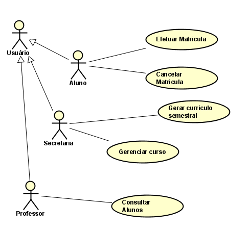
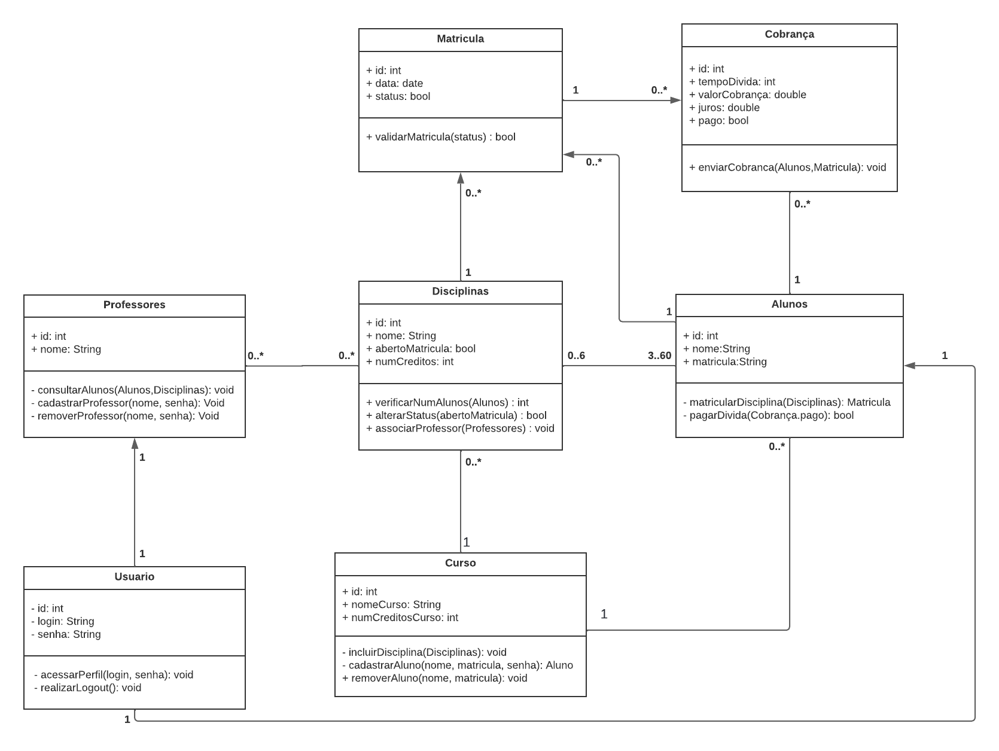

# Histórias de Usuário

## História 1: Matrícula em Disciplinas
**Como** aluno,  
**Eu quero** me matricular em até 4 disciplinas obrigatórias e 2 disciplinas optativas,  
**Para que** eu possa completar os créditos necessários para o meu curso.

### Critérios de Aceitação:
- O aluno deve poder visualizar as disciplinas disponíveis para o semestre.
- O aluno deve ser capaz de escolher até 4 disciplinas obrigatórias como primeira opção.
- O aluno deve ser capaz de escolher até 2 disciplinas optativas como alternativas.
- O sistema deve verificar se há vagas disponíveis antes de confirmar a matrícula.

## História 2: Cancelamento de Matrícula
**Como** aluno,  
**Eu quero** poder cancelar minha matrícula em uma disciplina,  
**Para que** eu possa ajustar meu horário ou corrigir uma escolha incorreta.

### Critérios de Aceitação:
- O aluno deve ser capaz de cancelar uma matrícula dentro do período permitido.
- O sistema deve permitir a visualização das disciplinas nas quais o aluno está matriculado.
- O sistema deve atualizar automaticamente as vagas disponíveis após o cancelamento.

## História 3: Validação e Encerramento de Disciplinas
**Como** administrador do sistema,  
**Eu quero** que as disciplinas com menos de 3 alunos matriculados sejam automaticamente canceladas,  
**Para que** apenas disciplinas com demanda mínima sejam oferecidas no semestre.

### Critérios de Aceitação:
- Ao final do período de matrícula, o sistema deve verificar o número de alunos inscritos em cada disciplina.
- Disciplinas com menos de 3 alunos devem ser automaticamente canceladas.
- Disciplinas com 60 alunos matriculados devem ser encerradas para novas inscrições.

## História 4: Notificação ao Sistema de Cobranças
**Como** administrador do sistema,  
**Eu quero** que o sistema de matrículas notifique automaticamente o sistema de cobranças após a inscrição de um aluno,  
**Para que** o aluno seja corretamente cobrado pelas disciplinas em que está matriculado.

### Critérios de Aceitação:
- Após a conclusão da matrícula, o sistema deve enviar uma notificação ao sistema de cobranças com os dados do aluno e as disciplinas em que ele se inscreveu.
- A notificação deve incluir o valor total a ser cobrado, baseado nos créditos das disciplinas.

## História 5: Acesso ao Sistema de Matrículas
**Como** aluno,  
**Eu quero** acessar o sistema de matrículas durante os períodos de matrícula definidos,  
**Para que** eu possa realizar minhas inscrições ou cancelamentos conforme necessário.

### Critérios de Aceitação:
- O sistema deve permitir o acesso ao portal de matrículas apenas durante os períodos de matrícula.
- Fora dos períodos de matrícula, o sistema deve exibir uma mensagem informando que as inscrições estão fechadas.
- O aluno deve poder ver as disciplinas oferecidas, o status da matrícula, e qualquer notificação relevante.

# Artefatos

## Casos de Uso

## Diagrama de Classes UML

## Diagrama de Entidades de Relacionamento

